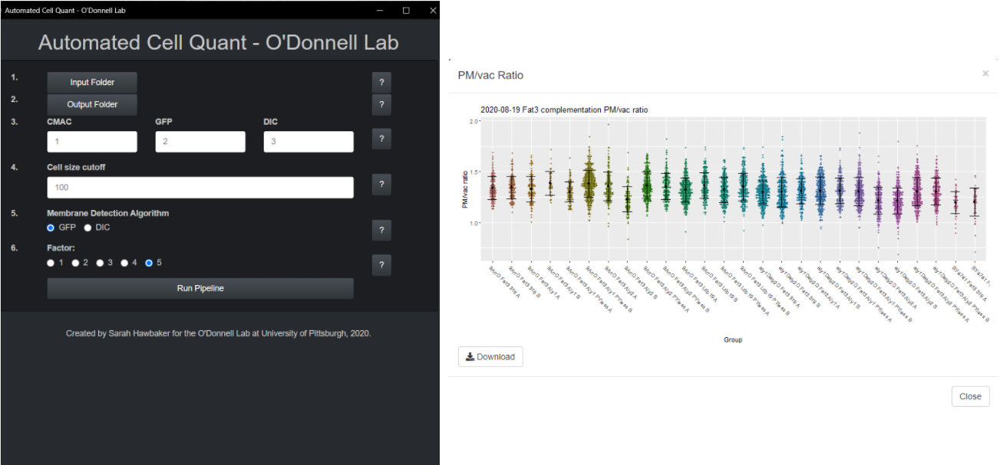

# CellQuant

 

## Overview

CellQuant was created for the O'Donnell Lab at the University of Pittsburgh to batch quantify plasma membrane and vacuolar fluorescence in yeast cells.  

## Features

* Two membrane detection algorithms for cases with low/high fluorescence at the cell membrane
* Supplemental visual output
* Applet to demonstrate the program at different application settings
* Applet to sort and graph results

## How to Run

### Without R Installation

The easiest way to run the CellQuant program is to download the zip file of the [latest release](https://github.com/sah129/CellQuant/releases/tag/v0.8-alpha). This comes with an R-portable so no previous installation of R is required.  [Google Chrome Portable](https://portableapps.com/apps/internet/google_chrome_portable) is used for rendering.  

### With R Installation

If you have R installed on your machine:  

1.  Clone this repository locally
2.  cd into the CellQuant directory
3.  start R
4.  run.R

## Dependencies

* Windows 7 or greater

* An installation of R is not required to run this program from the [prepackaged release](https://github.com/sah129/CellQuant/releases/tag/v0.8-alpha).  If running from a local clone of this repository, CellQuant has the following requirements:

* R 3.6.3 or higher

* Package dependences:  
```Bioconductor::EBImage
stringr
shiny
shinyFiles
shinyjs
shinythemes
tidyr
```

## Upcoming Features

- [ ] Mac OS compatibility
